# FAQ du plugin Suivi Conso

## Il me manque des informations HP/HC/PTEC
S'il vous manque des informations que vous ne pouvez pas récupérer, le tuto vous permettra de les simuler.

L'objectif de ce tuto est d'utiliser le Plugin sans les informations remontées par la teleinfo.
S'il vous manque : PTEC , index ...

[Voir le Tuto](./tutoriel_hp_hc.md)

## Questions Fréquentes

#### Je viens de paramétrer l'application, j'ai mon premier équipement et le panel tourne en boucle
Il faut attendre au moins 3h que des données soit créées et que la synchronisation entre les infos au fil de l'eau (Conso_teleinfo) soient remontées sur les infos du jours (conso_jour). Il est possible de le faire plus rapidement en allant dans le moteur de tâches et en forçant l'exécution manuellement. Il est intitulé "UpdateTable" pour conso.
Controler également qu'il y a au minimum un équipement actif et vérifier que celui-ci a bien une consommation qui évolue.

#### Je ne trouve pas le Widget dans le Dashboard de Jeedom
Le plugin ne s'affiche pas sur le Dashboard de Jeedom mais dans un panel. Il faut se rendre dans l'onglet Accueil->Suivi Conso

#### Le Panel ne s affiche pas dans L'onglet Accueil
Il faut activer l'affichage dans la configuration du plugin (Plugin -> Gestion des plugins -> suivi Conso -> Afficher le panel desktop)

#### Le plugin ne passe pas de HP a HC
Si vous passez par le plugin teleinfo, il faut vérifier que la commande PTEC soit de type Autre puis relancer le démon Téléinfo

#### Table 'jeedom.conso_tmp' doesn't exist
Erreur sur conso::StartDeamon() : [MySQL] Error code : 42S02 (1146). Table 'jeedom.conso_tmp' doesn't exist

Exécuter la requête MySql dans la base de données pour recréer la table

```sql
CREATE TABLE `conso_tmp` (
  `id_ecq` int(11) NOT NULL,
  `hp` bigint(20) DEFAULT NULL,
  `hc` bigint(20) DEFAULT NULL,
  `ptec` varchar(255) DEFAULT NULL,
  `lastvalue` bigint(20) DEFAULT NULL,
  `variation` bigint(20) DEFAULT NULL,
  `date_upd` datetime DEFAULT NULL,
  `tmp_value` float DEFAULT NULL,
  PRIMARY KEY (`id_ecq`)
) ENGINE=InnoDB DEFAULT CHARSET=latin1;
```
#### Pas de remontée/visualisation de consommation dans les graphiques jours/Mois/année
Essayer de décocher « Variation: Insère si Conso > Conso précédente » dans le menu configuration du plugin et relancer le démon SuiviConso

#### Bouton "Purger" provoque une erreur: [MySQL] Error code : 21S01 (1136). Column count doesn’t match value count at row 1 : INSERT IGNORE INTO conso_teleinfo_save SELECT * FROM conso_teleinfo
Cela veut dire qu'il manque des champs dans la table conso_teleinfo_save (Sans doute lors de la migration pour ajouter le tarif Tempo. Il faut alors exécuter la requête suivante:
```sql
drop table conso_teleinfo_save
```
et ensuite, relancer la purge.

#### Comment déterminer la valeur du champs "Variation max autorisé entre 2 mesures" en mode FGD212
Imaginons un chauffe eau qui consomme 2000W instantané. S’il consomme pendant 1h il aura alors consommé 2000 Wh. Les relevés dans suivi conso sont en générale tout les 1min 30 , 1min 50. On calcul donc la consommation pour se délai: 1h = 3600s, 1min 50 = 110s. On fait une régle de 3:
2000Wh * 110 / 3600 = 61,111 Wh
Donc le chauffe eau consommera au maximum 61 Wh entre chaque relevé. La dessus on se prend de la marge, car de toute façon quand il y a un pic de consommation cela se chiffre en général en plusieurs dizaines de kWh. Du coup, 500 serait une valeur raisonnable dans la case « Variation max autorisée »

#### Comment corriger une valeur anormale remontée dans le plugin.
Exemple en tarif Tempo, où on a un pic de consommation de remonté sur les HC blanc:

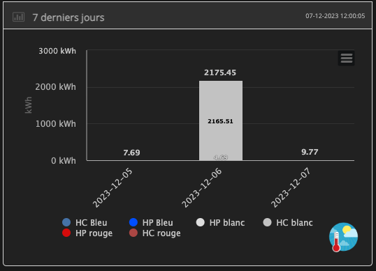

La correction doit donc permettre de retrouver une consommation correcte dans tout les éléments du dashboard.

Dans un premier temps installer Adminer qui est un petit utilitaire pour consulter les base de données. Je met juste le fichier dans le répertoire html.

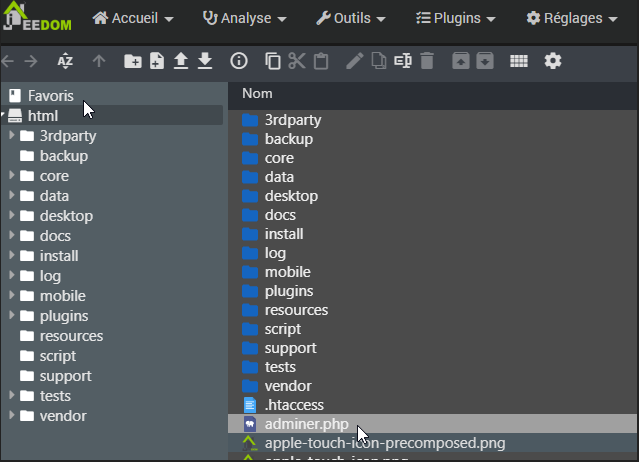

Ensuite lancer Adminer:
Donc url d’accès à Jeedom /adminer.php (Exemple en local: http://192.168.50.46/adminer.php)

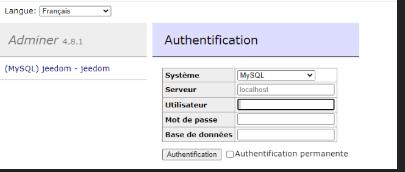

Entrer l’utilisateur et le mot de passe de la BD trouvés dans système|configuration|>_OS/DB

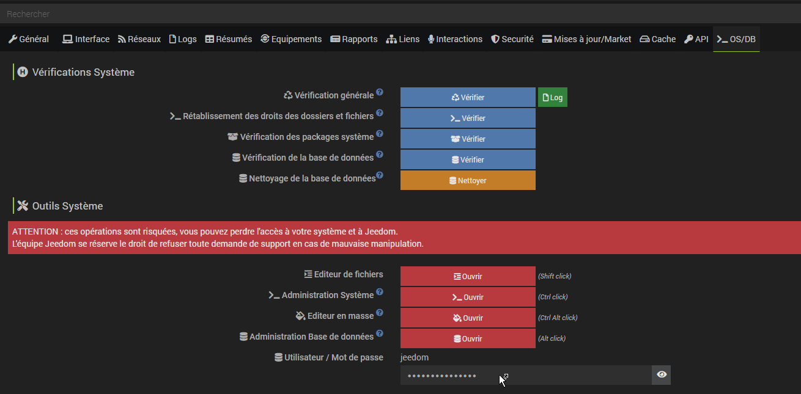
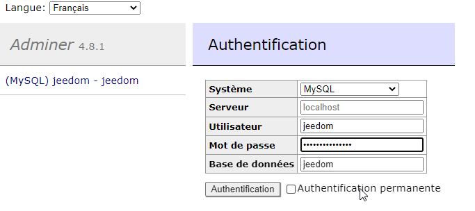

Choisir de consulter la table conso_teleinfo

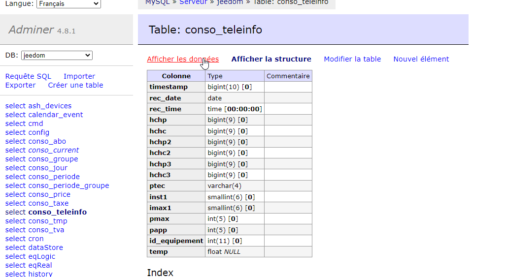

Filtrer sur la date du problème le 06/12/2023 avec le champs rec_date = '2023-12-06'

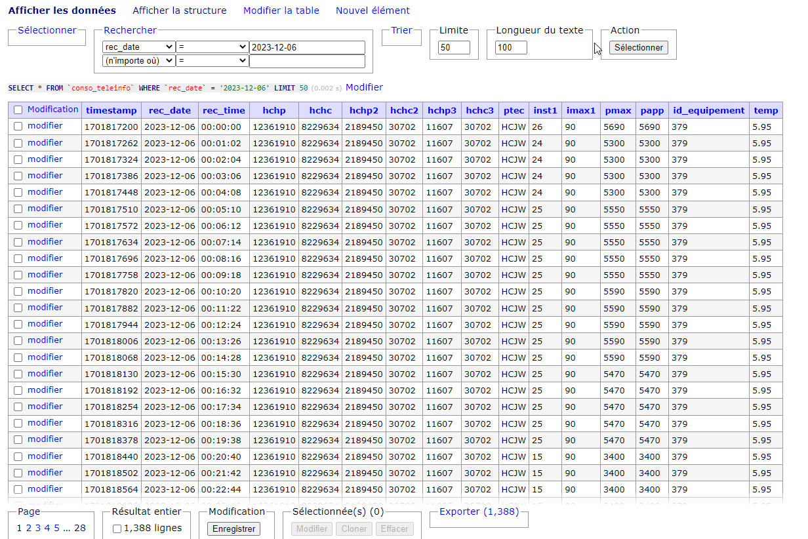

On sait que le problème est sur les jours HC blancs. On regarde alors la colonne HCHC2 et on cherche un gros écart d’index. On voit que c’est arrivé à 15:32:09.

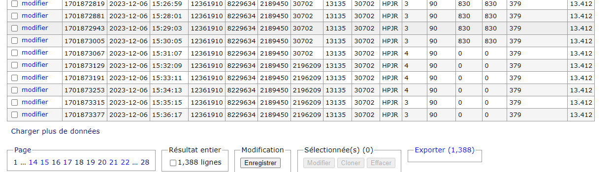

il faut alors corriger pour enlever cet écart. Tu peux le faire avec le correcteur intégré ou bien avec une requête. On va s’arranger pour supprimer l’écart tout en conservant les éventuelles évolutions de l’index avant l’anomalie.
```sql
update conso_teleinfo set hchc2 = hchc2 + 2196209 - 30702 where rec_date = '2023-12-06' and id_equipement = 379 and rec_time <= '15:31:07'
```

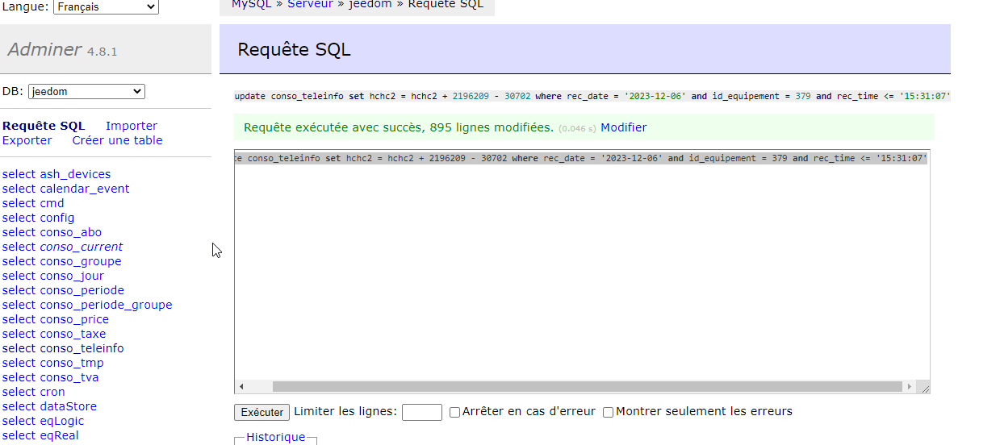

Il ne reste plus qu’à synchroniser.

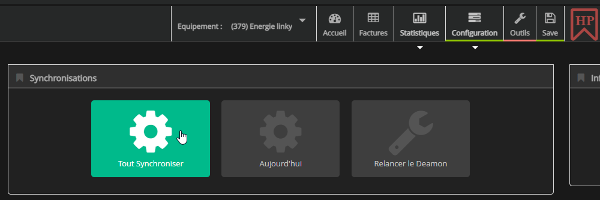

Et voilà.

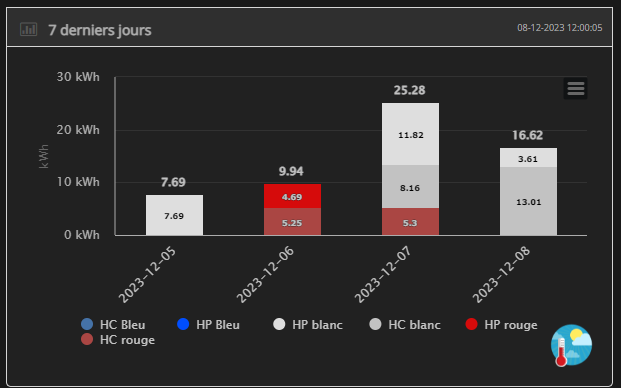
