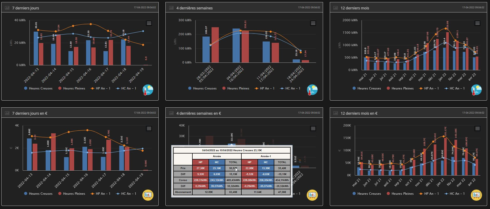
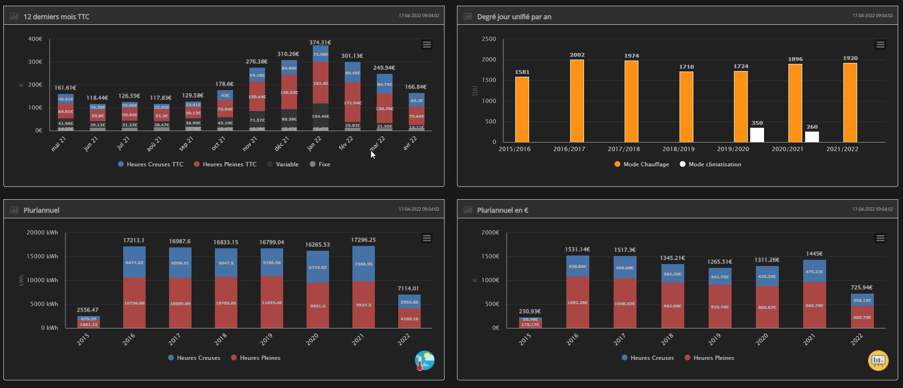

# Suivi Conso

## Présentation

Le plugin Conso permet de suivre sa consommation :
 - CONSOMMATION ELECTRIQUE
 - PRODUCTION ELECTRIQUE
 - EAU
 - GAZ
 - FIOUL

Pour cela il faut créer et renseigner des équipements dans le plugin et garnir les commandes associées dans chaques paramètres avec les informations de mesure en provenance des différents capteurs présents dans Jeedom.  
Il est compatible nativement avec les abonnements de base, Heures pleines/Heures Creuses, Tempo. Il est également possible de traiter d'autres types d'abonnement nécessitant jusqu'à 6 tarifs en utilisant le choix "Tempo, exemple: Super Heure Creuse   

## Paramètres obligatoires :

### CONSOMMATION ELECTRIQUE :

**Abonnement de base :**
 - L'index ( BASE )
 - La puissance apparente instantanée ( PAPP )

**Abonnement HP/HC :**
 - Index heures creuses
 - Index heures pleines
 - La tranche tarifaire ( PTEC ) avec les valeurs attendues: HP ou HC.
 - La puissance instantanée ( PAPP )

 **Abonnement Tempo :**
  - Index heures creuses bleu
  - Index heures pleines bleu
  - Index heures creuses blanc
  - Index heures pleines blanc
  - Index heures creuses rouge
  - Index heures pleines rouge
  - La tranche tarifaire ( PTEC ) avec les valeurs attendues: HPJB, HCJB, HPJW, HCHW, HPJR, HCJR.
  - La puissance instantanée ( PAPP )

**Autres Modules avec la commande consommation disponible  (Ex : FGD-212) :**  

 - Puissance instantanée
 - Consommation

**Autres Modules sans la commande consommation disponible (Ex : FGD-211) :**  

 - Etat
 - Consommation électrique déclarée

**Paramètres optionnels :**

 - Intensité instantanée
 - Intensité maximale
 - Température Extérieure

**Il permet de visualiser :**

 - La puissance instantanée
 - La température du jour
 - La consommation du jour
 - La consommation de la veille
 - La puissance maximale et minimale du jour
 - Les degrés jour unifiés (DJU)
 - Les températures
 - Les prévisions de consommation lorsqu'il existe un historique de plus d'un an

**Il génère automatiquement les graphiques :**

 - Consommation des 7 derniers jours (en kWh)
 - Consommation du mois par semaine (en kWh)
 - Consommation par mois sur 1 an (en kWh)
 - Consommation pluriannuelle (en kWh)

 - Consommation des 7 derniers jours (en euro HT)
 - Consommation du mois par semaine (en euro HT)
 - Consommation par mois sur 1 an (en euro HT)
 - Consommation par mois TTC
 - Consommation pluriannuelle (en euro HT)

 - des camemberts affichant la répartition de consommation des différents sous-consommateurs

**Le plugin vous permet aussi  :**

 - De Générer des graphiques sur une période donnée
 - De générer les factures sur une période donnée (pour toutes les catégories)
 - De sauvegarder toutes vos données ou d'importer vos données depuis un serveur distant ou par fichier
 - D'avoir des commandes disponibles pour chaque équipement afin de suivre l'historique des consommations et des coûts indépendamment du plugin.
	- Jour - 1
	- Jour - 2
	- Semaine - 1
	- Semaine - 2
	- Mois - 1
	- Mois - 2
	- Année - 1
	- Année - 2
	- Printemps
	- Eté
	- Automne
	- Hiver
	- 7 jours en arrière glissant
	- 15 jours en arrière glissant
	- 31 jours en arrière glissant

### PRODUCTION ELECTRIQUE

**Abonnement de base :**
 - L'index ( BASE )
 - La puissance apparente instantanée ( PAPP )

**Abonnement HP/HC :**
 - Index heures creuses
 - Index heures pleines
 - La tranche tarifaire ( PTEC )
 - La puissance instantanée ( PAPP )

**Autres Modules avec la commande consommation disponible  (Ex : FGD-212) :**  

 - Puissance instantanée
 - Consommation

**Autres Modules sans la commande consommation disponible (Ex : FGD-211) :**  

 - Etat
 - Consommation électrique déclarée

**Paramètres optionnels :**

 - Intensité instantanée
 - Intensité maximale
 - Température Extérieure

### EAU :

 - Nombre d'impulsions totales
 - 1 Impulsion égal _**x**_ Litre

### GAZ :

 - Nombre d'impulsions totales
 - 1 Impulsion égal _**x**_ dm3

### FIOUL :

 - Nombre d'impulsions totales
 - 1 Impulsion égal _**x**_ Litre

# Présentation :

## Configuration du plugin:
[Configuration](configuration.md)

## Configuration des équipements :
[Partie_1](partie_1.md)

## Le panel
[Partie_2](partie_2.md)

## Vérification du fonctionnement
[Partie_3](partie_3.md)

## Changelog
[changelog](changelog.md)

## Faq
[faq](faq.md)
