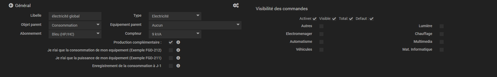
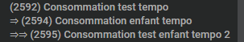
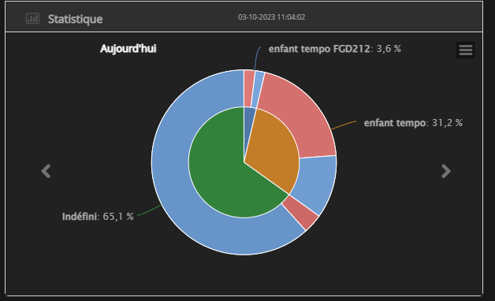
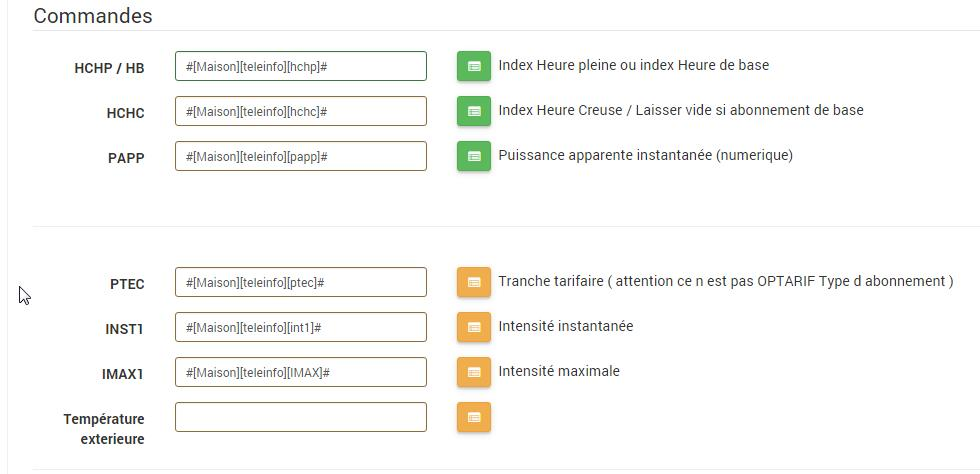

# Configuration

Pour configurer votre équipement il faut se rendre dans l'onglet du plugin Suivi Conso. 
_**Plugins / Energie / Suivi Conso**_  

Cliquer sur "Ajouter un équipement"  

**Libelle** : Nom de votre équipement  

**Type** : Electricité ou Prod. Elect. ou Gaz ou Fioul ou Eau 

**Objet Parent** : renseigner la catégorie de votre équipement.  

**Equipement parent** : Permet de rattacher un équipement à  un parent afin de récupérer les informations du père.  

**Compteur**: Puissance maximale pouvant être atteinte. La graduation de la jauge de puissance dépend de cette information. Pour les sous-équipemnts il y a la possibilité de définir un maximal différent.

**Informations récupérées du parent :**
 - Abonnement
 - Compteur/Puissance (par défaut, mais modifiable tout de même pour les sous-équipements pour régler l'échelle de la jauge. Pour cela cocher la case "Puissance personnalisée")
 - Type
 - Commande PTEC
 - Commande IMAX

**Abonnement :** Le type de tarif actuellement géré. Bleu(Heure pleine, heure creuse), Base (heure pleine), Tempo (heure pleine, heure creuse)  

**Production complémentaire :** Lorsqu'une hiérarchie parent enfants (équipement principal, sous-équipement) existe, un graphe camembert de la répartition des consommations apparait. Si la somme de la consommation des enfants dépasse celle de l'équipemnt parent, alors un message d'erreur apparaitra. Si jamais on place en tant que sous équipement la production solaire alors pause le problème puisque la somme de cconsommation dépassera l'équipement parent. Cette cas s'il est cochée permet de passer outre ce problème. 

**Je n'ai que la consommation de mon équipement (Exemple FGD-212)  :**  
 - Commande disponible :  
 - Consommation Kwh ou Wh  
 - Puissance PAPP

**je n'ai que la puissance de mon équipement (Exemple FGD-211) :**  
Commande disponible :  
 - Etat : Votre équipement est allumé ou éteint (Type : numerique 0 ou 1 )  
 - Consommation électrique déclarée  (Wh) La consommation de vos ampoules ou équipements une fois mesurée

**Enregistrement de la consommation à J-1 :**  
 Ce paramétrage est dédié à l'utilisation des plugin type Enedis ou Gaspar qui remontent le jour J l'information de consommation de la veille. Cela permet d'enregistrer la consommation sur la date de la veille. En cas d'utilisation il n'y aura donc aucune information sur le jour en cours dans les graphiques et dans les tableaux de consommation/prix.

**Catégories :**  
 Elles servent quand une hiérarchie père enfants existe. (Exemple: père: consommation de la maison, enfants: consommation du chauffage, consommation de la lumière ...). Elles servent pour l'affichage d'un camembert de répartition des consommation dans le tableau Statisitique. Elles ne sont utiles que pour les enfants dans la hiérarchie. Elles permettent de regrouper plusieurs équipement. Par exemple si on a 2 équipements pour la lumère (Salle à manger, Cuisine), en cichant la catégorie "lumière", cela permettra d'avoir une seul rubrique lumière dans le camembert représentant les 2 lumières salle à manger et cuisine.
 Dans le cas où aucune case n'est cochée sur l'enfant, alors ce sera le libellé de l'équipement qui apparaitra dans le camembert.
 Il peut y avoir plusieurs niveaux de hiérarchie. Le camembert affiché concernera alors le niveau de l'enfant sur lequel on se trouve. . 
   
   
  

 Une catégorie "indéfinie" apparaitra automatiquement dans le camembert. Elle représente l'cart entre la consommation du père et la somme de consommation des enfants. Elle représente donc la partie détaillée non mesurée de la consommation.

 Exemple: Il peut être interressant de l'utiliser pour calculer son taux d'autoconsommation quand on possède des panneaux solaires. Il suffit alors de mesurer la consommation globale de la maison en tant que père et d'ensuite renseigner un enfant qui récupèrera la teleinfo du compteur Linky (représentant sa consommation). Le camembert donnera alors le taux d'autoconsommation dans la catégorie "Indéfinie" qui sera en réalité ce que la maison a consommée à partir de la production solaire.

# Important :
 Si la somme de la consommation des enfants est supérieure à celle du père, le camembert ne s'affichera pas. Le moyen de passer outre cela est de cocher la case "Production complémentaire" au niveau du paramétrage de l'équipement père pour indiquer que l'on produit plus que ce que l'on consomme.

## Si un parent a été attribué :

 **Application Abonnement :** 
 Permet d'appliquer l'abonnement sur l'équipement enfant. 

 **Puissance personnalisée :**
 Si coché remplace le champ _**Compteur**_ par le champ _**Puissance**_ :
 - Si le champ est vide alors la jauge sera automatique. Elle prendra la valeur max de la journée qu'elle arrondira au kVa superieur et l'appliquera à la jauge.
 - Si vous spécifiez une valeur, la jauge se configura par rapport à votre valeur.

Si votre équipement est un total cocher la case Total.  
Le bouton Défaut permet d'afficher un équipement au démarrage de votre panel. 
Ces deux cases ne sont disponibles que pour les équipements qui n'ont pas de parent. 

Une fois les informations renseignées, il faut ajouter les commandes nécessaires au bon fonctionnement du plugin .  
Pour cela cliquer sur _**Ajouter les commandes**_  

Pour sélectionner les commandes il faut cliquer sur la pastille verte ou orange pour récupérer les informations .  

Puis il vous faut récupérer les commandes configurées dans Jeedom.  

