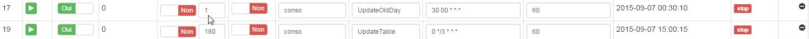

Pour verifier le bon fontionnement du plugin assurez vous que toutes vos commandes inserées dans la configuration retourne bien les bonnes valeurs. 
( Si vous récuperez les valeurs du plugin téléinfo , cliquer sur le bouton "tester" de ce plugin afin de vous assurer que toutes les commandes vous retournent la bonne information ) 

## Les crons et Démon

Le plugin utilise 2 cron et 1 Deamon 
Il existe 2 tables de données 

La table conso_teleinfo contient les données des commandes.
La table conso_jour contient les données calculées.

## StartDeamon
Le démon permet de recuperer les informations de chaque commandes et de les stocker dans la table conso_teleinfo. 
Pour modifier la frequence de récuperation des données, vous pouvez modifier la valeur de la colonne "Démon"  ( voir dans le moteur des taches de jeedom) 
Ce démon tourne toutes les minute par défaut. 

## UpdateOldDay
Le cron UpdateOldDay permet de mettre a jour toutes les informations de la table jour.
Ce cron tourne tous les jours a 00:30 

## UpdateTable
Le cron UpdateTable permet de mettre a jour la ligne du jour de la table conso_jour.
Ce cron tourne toutes les 3 minutes.

Les tables Conso_jour et conso_teleinfo sont disponibles dans le panel , onglet "Info" 

