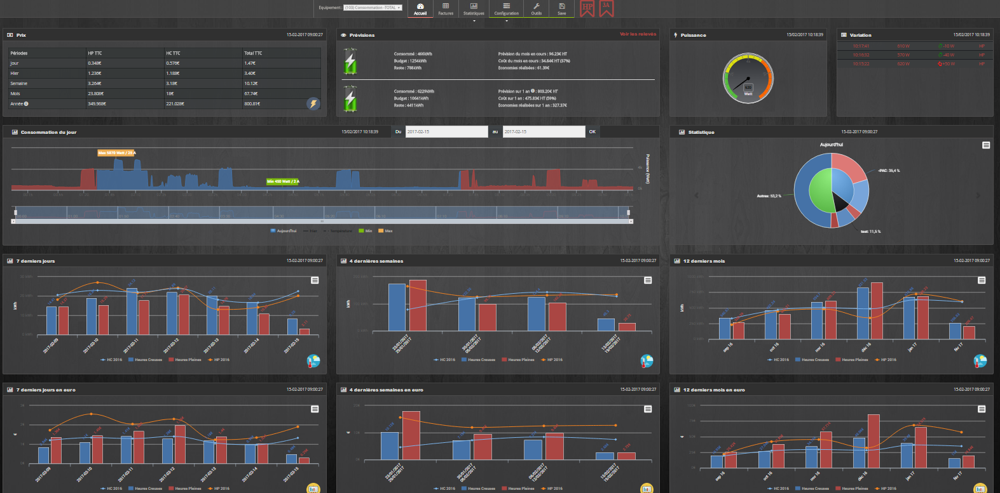

# Suivi Conso

## Présentation

Le plugin Conso permet de suivre sa consommation : 
 - CONSOMMATION ELECTRIQUE 
 - PRODUCTION ELECTRIQUE
 - EAU
 - GAZ
 - FIOUL

Pour cela il faut sélectionner les commandes associées dans chaques paramètres.  
Il est compatible avec les abonnements de base et les Heures pleines / Heures Creuses.   

Il vous faut récupérer les commandes dans Jeedom pour faire fonctionner le plugin : 

## Paramètres obligatoires : 

### CONSOMMATION ELECTRIQUE :

**Abonnement de base :** 
 - L'index ( BASE )
 - La puissance apparente instantanée ( PAPP )

**Abonnement HP/HC :** 
 - Index heures creuses
 - Index heures pleines
 - La tranche tarifaire ( PTEC )
 - La puissance instantanée ( PAPP )

**Autres Modules avec la commande consommation disponible  (Ex : FGD-212) :**  

 - Puissance instantanée
 - Consommation

**Autres Modules  sans la commande consommation disponible (Ex : FGD-211) :**  

 - Etat
 - Consommation électrique déclarée

**Parametres optionnels :** 

 - Intensité instantanée 
 - Intensité maximal 
 - Température Exterieure

**Il permet de visualiser :**

 - La puissance instantanée 
 - La température du jour
 - La consommation du jour 
 - La consommation de la veille 
 - La puissance maximale et minimale du jour 
 - Les degrés jour unifiés (DJU) 
 - Les températures 
 - Les prévisions de consommation lorsqu'il existe un historique de plus d'un an 

**Il génère automatiquement les graphiques :** 

 - Consommation des 7 derniers jours (en Kwh) 
 - Consommation du mois par semaine (en Kwh) 
 - Consommation par mois sur 1 an (en Kwh) 

 - Consommation des 7 derniers jours (en euro) 
 - Consommation du mois par semaine (en euro) 
 - Consommation par mois sur 1 an (en euro) 
 - Consommation par mois TTC

**Le plugin vous permet aussi  :**

 - De Générer des graphiques sur une période donnée 
 - De générer les factures sur une période donnée (pour toutes les catégories) 
 - De sauvegarder toutes vos données ou d'importer vos données depuis un serveur distant ou par fichier
 - D'avoir des commandes disponibles pour chaque équipement afin de suivre l'historique des comsommations et des coûts indépendamment du plugin.
	- Jour - 1
	- Jour - 2
	- Semaine - 1
	- Semaine - 2
	- Mois - 1
	- Mois - 2
	- Année - 1
	- Année - 2
	- Printemps
	- Eté
	- Automne
	- Hivers
	- 7 jours en arrière glissant
	- 15 jours en arrière glissant
	- 31 jours en arrière glissant

### PRODUCTION ELECTRIQUE

**Abonnement de base :** 
 - L'index ( BASE )
 - La puissance apparente instantanée ( PAPP )

**Abonnement HP/HC :** 
 - Index heures creuses
 - Index heures pleine
 - La tranche tarifaire ( PTEC )
 - La puissance instantannée ( PAPP )

**Autres Modules avec la commande consommation disponible  (Ex : FGD-212) :**  

 - Puissance instantanée
 - Consommation

**Autres Modules  sans la commande consommation disponible (Ex : FGD-211) :**  

 - Etat
 - Consommation électrique déclarée

**Parametres optionnels :** 

 - Intensité instantanée 
 - Intensité maximale 
 - Température Extérieure

### EAU :

 - Nombre d'impulsion totale
 - 1 Impulsion égal _**x**_ Litre

### GAZ :

 - Nombre d'impulsion totale
 - 1 Impulsion égal _**x**_ dm3

### FIOUL :

 - Nombre d'impulsion totale
 - 1 Impulsion égal _**x**_ Litre

# Présentation : 

## Configuration du plugin: 
[Configuration](configuration.md)

## Configuration des équipements : 
[Partie_1](partie_1.md)

## Le panel
[Partie_2](partie_2.md)

## Vérification du fonctionnement
[Partie_3](partie_3.md)

## Changelog
[changelog](changelog.md)

## Faq
[faq](faq.md)