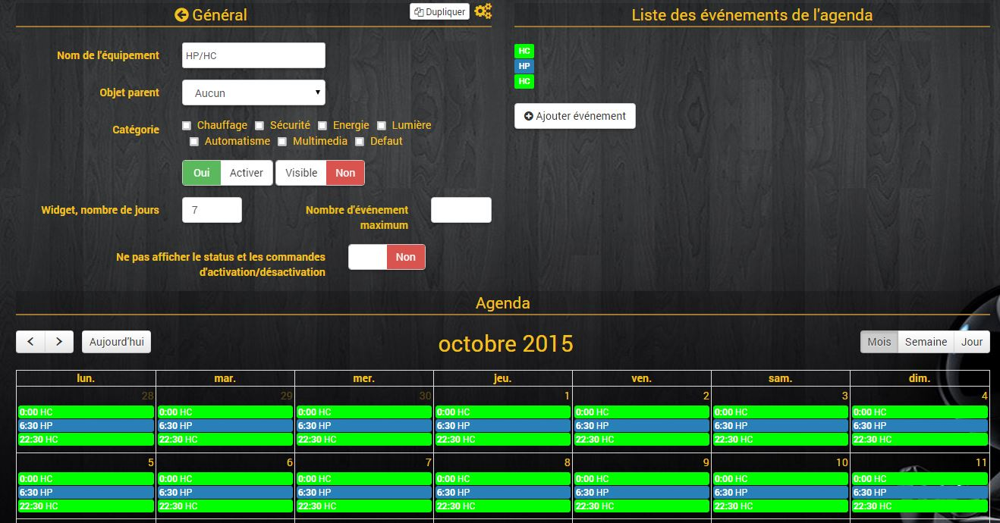
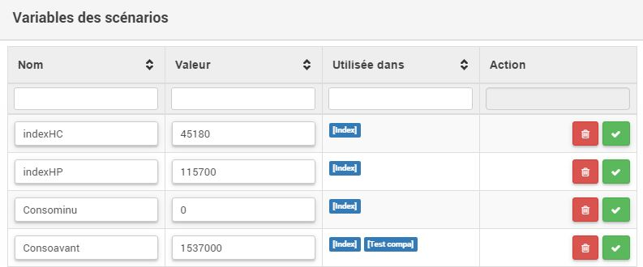
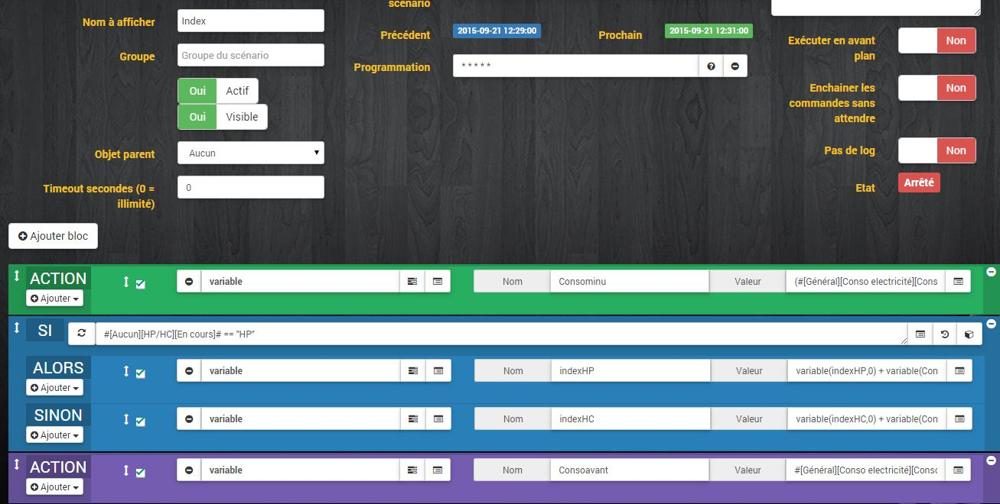
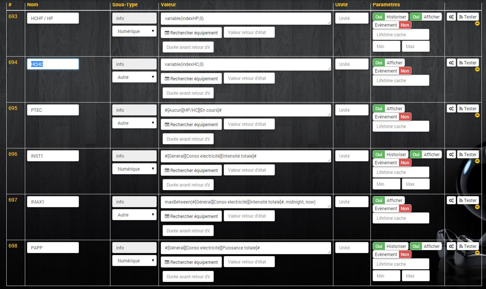
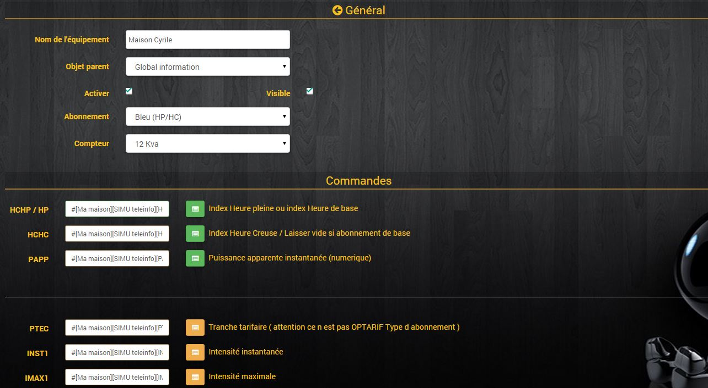

# Tuto pour utiliser le Plugin Suivi Conso sans téléinfo par Fcna et Mutmut.

L’objectif de ce tuto est d’utiliser le Plugin sans les informations remontées par la teleinfo.

## Prérequis :
### Plugins :
- Plugin Suivi Conso !
- Virtuel
- Agenda (Si HC / HP)

### Informations : 
- Puissance ou consommation
- Intensité (optionnelle)
- Mode opératoire

_**1/ (option sur abonnement HC/HP) :**_


_Récupération HC / HP (Input PTEC du plugin, Tranche tarifaire)_


C’est assez simple. Il suffit de créer un nouvel agenda.<br>
Dans le plugin agenda (officiel), on ajoute un agenda.<br>
Dans mon cas l’agenda s’appelle HP/HC<br>
On ajoute les événements en fonction de son abonnement. Dans mon cas, HP de 6H30 à 22H30, le reste HC.<br>
Notes : Il faut que le nom des évènements soit HC et HP obligatoirement.<br>
Donc, un évènement HC de 00h00 à 6h30, répété tous les jours.<br>
Un évènement HP de 6h30 à 22h30, répété tous les jours.<br>
Puis un dernier de 22h30 à 00h00, tous les jours aussi.<br>

Vous devriez avoir ca :


_**2/ Calcul de l’index :**_

Récupération des infos HCHP / HP et HCHC. <br>
Avec les informations de consommation. <br>
Tout d’abord, il faut créer 4 variables : <br>
indexHC, indexHP, Consominu, Consoavant et mettre toutes les variables à 0. <br>



Ensuite on va faire un scénario.<br>
Mode du scénario : programmé toutes les minutes.<br>
Les instructions du scénario :<br>



En détail :

```js
ACTION
     (variable) Affectation de la variable : Consominu à (#642# * 1000)  -  variable(Consoavant,0) 
    
    SI #[Aucun][HP/HC][En cours]# == "HP"  
    ALORS
     (variable) Affectation de la variable : indexHP à variable(indexHP,0) + variable(Consominu,0) 
    SINON
     (variable) Affectation de la variable : indexHC à variable(indexHC,0) + variable(Consominu,0) 
    
    ACTION
     (variable) Affectation de la variable : Consoavant à #642# * 1000 
```
PS : ma consommation est en kWh, donc je multiplie par 1 000.<br>
#642# : correspond à la conso remontée par ma pince<br>

Avec les informations de puissances.<br>


Le scénario est plus simple (avec uniquement les variables : indexHC, indexHP)<br>

```js
SI #[Aucun][HP/HC][En cours]# == "HP"  
    ALORS
     (variable) Affectation de la variable : indexHP à variable(indexHP,0) + (#646#/60)
    SINON
     (variable) Affectation de la variable : indexHC à variable(indexHC,0) + (#646#/60)
#646# : correspond à la puissance remontée par ma pince
```

_**3/ Création du virtuel pour regrouper toutes les informations :**_

Détail des informations virtuelles :
- HCHP / HP : variable(indexHP,0)
- HCHC : variable(indexHC,0)
- PTEC : #[Aucun][HP/HC][En cours]#
    C’est les informations du calendrier créé en 1
- INST1 : Mettre ici directement les informations remontées par la pince
- IMAX1 : maxBetween(#[Général][Conso electricité][Intensité totale]#, midnight, now)
- PAPP : Mettre ici directement les informations remontées par la pince

Vous devriez avoir ca:



_**4/ configuration du plugin Suivi Conso**_

Mettre les infos du virtuel (facile comme on a pris les mêmes noms)



Ensuite, on vérifie dans le plugin, onglet info que les informations remontent bien<br><br>

Merci à Mutmut pour son Aide<br>
Merci à Mickey pour le plug in