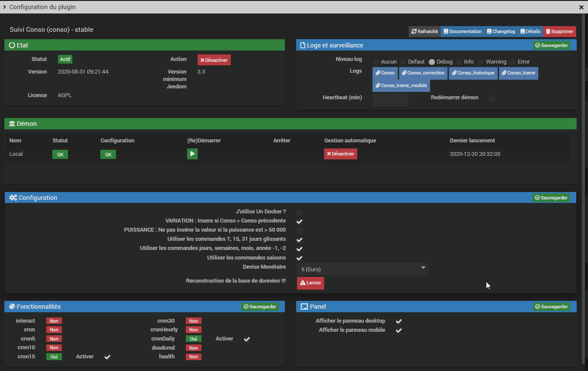
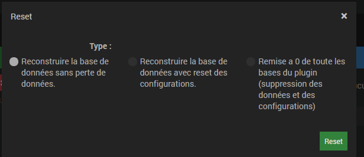

# Configuration du plugin

Il y a quelques paramètres à mettre à jour dans la configuration générale du plugin 
_**Plugins / Energie / Suivi Conso / configuration**_  

**J'utilise Un Docker ?** : Comme son libellé l'indique, à cocher si votre Jeedom est sous Docker  

**VARIATION : Insere si Conso > Conso précedente** : Permet de ne pas prendre en compte l'index si sa valeur est plus petite que la fois précédente. Pour éviter les aberrations de consommations  

**PUISSANCE : Ne pas insérer la valeur si la puissance est > 50 000** : Pour éviter de prendre en compte des valeurs de report de puissance fantaisistes et de fausser ainsi les calculs.  

**Utiliser les commandes 7, 15, 31 jours glissants** : Cocher cette case permet de créer pour chaque équipement les commandes de report de consommations et de coûts pour les 7, 15, 31 derniers jours glissants.  

**Utiliser les commandes jours, semaines, mois, année -1, -2** : Cocher cette case permet de créer pour chaque équipement les commandes de report de consommations et de coûts pour les jours -1, -2, semaines -1, -2, mois -1, -2, année -1, -2.  

**Utiliser les commandes saisons** : Cocher cette case permet de créer pour chaque équipement les commandes de report de consommations et de coûts pour les 4 saisons passées (Printemps, Eté, Automne, Hivers).  

**Devise Monétaire** : Choix de la devise monétaire apparaissant dans le dashboard et les factures 

**Reconstruction de la base de données !!!** : Permet de réparer la base de données du plugin en cas de problème. _**Cet outil est à utiliser avec précaution et en ayant fait une sauvegarde préalable**_  

